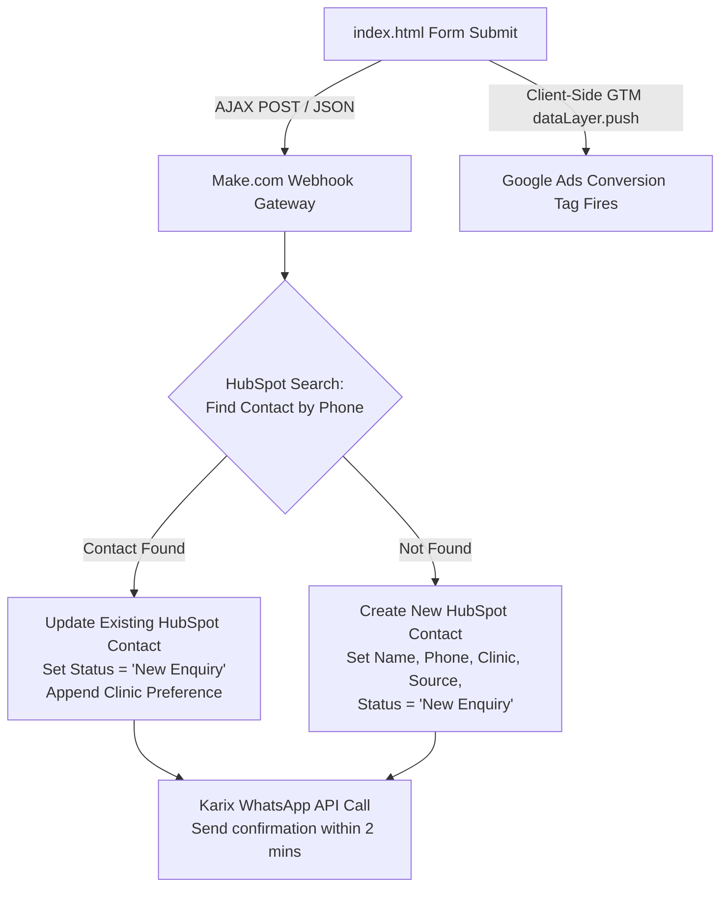

# Task 03 - HubSpot & WhatsApp CRM Integration Design

This document outlines the end-to-end integration architecture to sync OrthoNow's landing page leads with HubSpot CRM, fire instant WhatsApp confirmations via Karix, and record conversions in Google Ads.

---

## 1. End-to-End Architecture

We will architect this integration using **Make.com** (formerly Integromat) as our secure middleware connector. It provides native retry logic, error handling, and visual debugging.

### Process Flow & Sequence:
1. **Form Submission:** When a patient submits the landing page form, two paths fire concurrently:
   - **Client-Side:** The form fires a `dataLayer.push` containing the event `consultation_form_submitted`. GTM listens to this and triggers the Google Ads Conversion Tag. This ensures the conversion is tied to the user's click ID (GCLID) and session cookie.
   - **Server-Side:** The form makes an asynchronous HTTP POST request sending `Name`, `Phone`, and `Clinic Preference` to a Make.com webhook.
2. **Contact Deduplication (HubSpot):**
   - *The HubSpot Trap:* HubSpot's default deduplication is based exclusively on `email`. Since our form is minimal (Name + Phone, no email), a standard contact creation request would result in duplicate entries every time the same patient submits the form.
   - *Solution:* In Make.com, we first query the HubSpot CRM Search API (`/crm/v3/objects/contacts/search`) matching the phone number.
     - **If Match Found:** We update the existing contact's fields (updating Name to latest, setting Clinic Preference, updating source info in a custom array, and resetting Lead Status to 'New Enquiry'). We add a timeline note detailing the duplicate inquiry.
     - **If No Match:** We create a new contact record with Name, Phone, Clinic Preference, Source = `Google Ads - Consultation Landing Page`, and Lead Status = `New Enquiry`.
3. **WhatsApp Dispatch (Karix API):**
   - Make.com makes an HTTP POST call to the Karix WhatsApp Business API.
   - It sends an approved WhatsApp Template message: `Hi {Name}, thank you for booking a consultation at OrthoNow. We have received your request for our {Clinic} clinic. A coordinator will call you shortly.`

---

## 2. Failure Points and Mitigation

### Single Biggest Failure Point
**Downstream API Downtime (HubSpot or Karix rate limit / outage):** If HubSpot or Karix is temporarily down or rejecting requests, leads will be lost.

**Fallback Design:**
- **Data Buffering:** The webhook endpoint will immediately write the raw lead details to a lightweight database (e.g. Supabase or a Google Sheet) before doing any API calls. This creates a persistent transaction log.
- **Queue & Retry:** In Make.com, we enable "Store incomplete executions." If any downstream step (HubSpot or Karix) fails, the lead is held in a queue, and Make's automatic exponential retry triggers. If it fails permanently, an alert notifies the dev team, who can bulk-replay the transactions from the Supabase/Google Sheet log.

---

## 3. WhatsApp 2-Minute SLA Monitoring

### What could break the SLA?
- Karix API service degradation or high network latency.
- Messaging template issues (e.g., sending variables in incorrect formats).
- Message backlog due to middleware rate-limiting or concurrency spikes.

### Monitoring & Fallbacks:
- **Middleware Alerts:** Configure Make.com to trigger instant Slack/Email alerts if a scenario execution fails or takes longer than 30 seconds.
- **DLR Webhooks:** Configure Karix Delivery Receipts (DLR) to send message status back to our webhook.
- **Auto-SMS Fallback:** Set a 2-minute timer on lead creation. If the Karix DLR status is not updated to `sent` or `delivered` within 90 seconds, the middleware automatically triggers an alternative SMS channel (e.g., Twilio) to deliver the confirmation, ensuring compliance with the 2-minute SLA.
